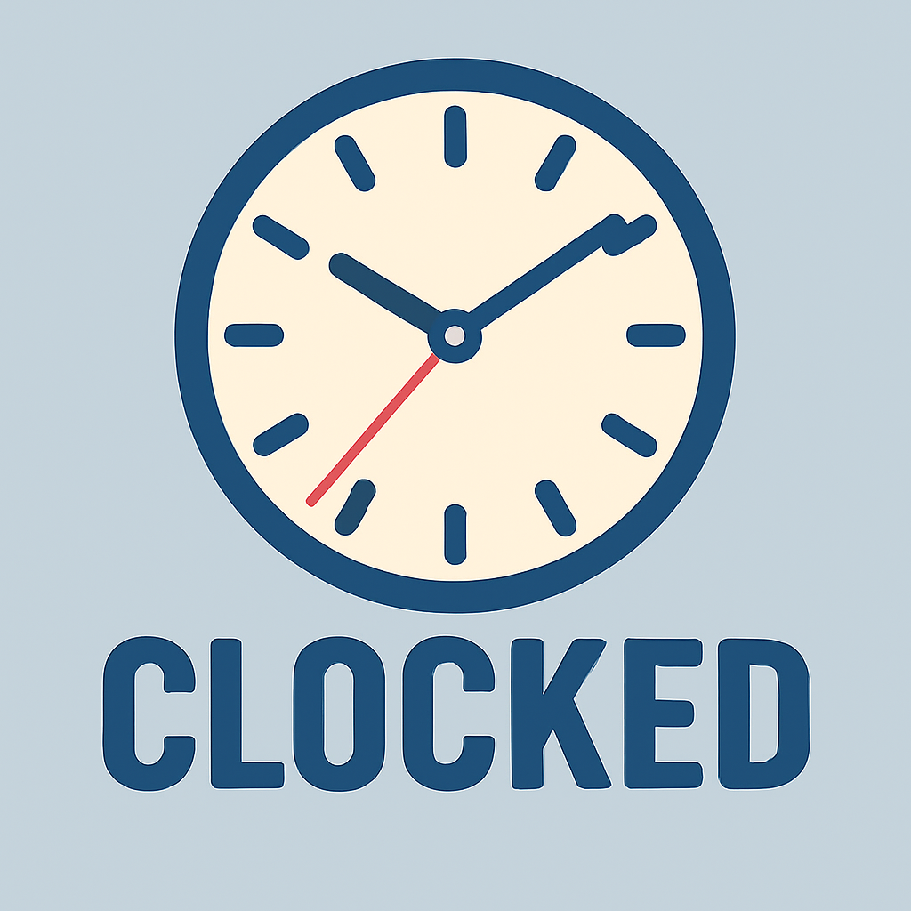
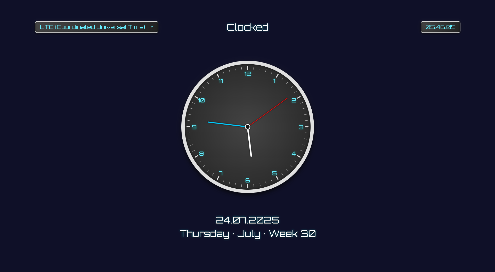

<p align="center">
    
</p>

## Description

Clocked is a stylish browser based clock that combines a smooth analog dial with a glowing digital display. It also shows a detailed date section including the current calendar week. The design is clean and glowing with real time updates and optional timezone selection.

## Live Demo

You can try it out here:

[GitHub Pages Demo Link](https://feldherrweiprecht.github.io/Clocked/)

## How It Works

1. Shows a central analog clock with ticking second, minute and hour hands.
2. Displays a glowing digital clock in the top right corner.
3. Allows switching between popular timezones using a dropdown in the top left.
4. Shows the full date below the clock: day, month, year, weekday monthname and calendar week.
5. All displays update every second in real time.

## Requirements

Clocked runs entirely in your browser and does not require installation. To run or develop locally:

- Any modern browser like `Chrome`, `Edge`, `Firefox` or `Safari`.
- Local web server (recommended for testing).

## Usage

You can either:

- Open `index.html` directly in your browser.
- Or start a local web server (recommended) for best compatibility.

To start a local web server using `Python`, run this command in the terminal:

```bash
python -m http.server
```

Then open [http://localhost:8000](http://localhost:8000) in your browser.

If you are using VS Code, the `Live Server` extension also works well.

## Files

- `index.html` – Structure of the app.
- `style.css` – Full visual styling including.
- `script.js` – Entire Clocked logic.

## Notes

- For the best experience make sure your browser is set to `100% zoom level`. Because incorrect zoom settings may cause input or positioning issues.
- The timezone dropdown adjusts both analog and digital clocks as well as the full date.

## Example


